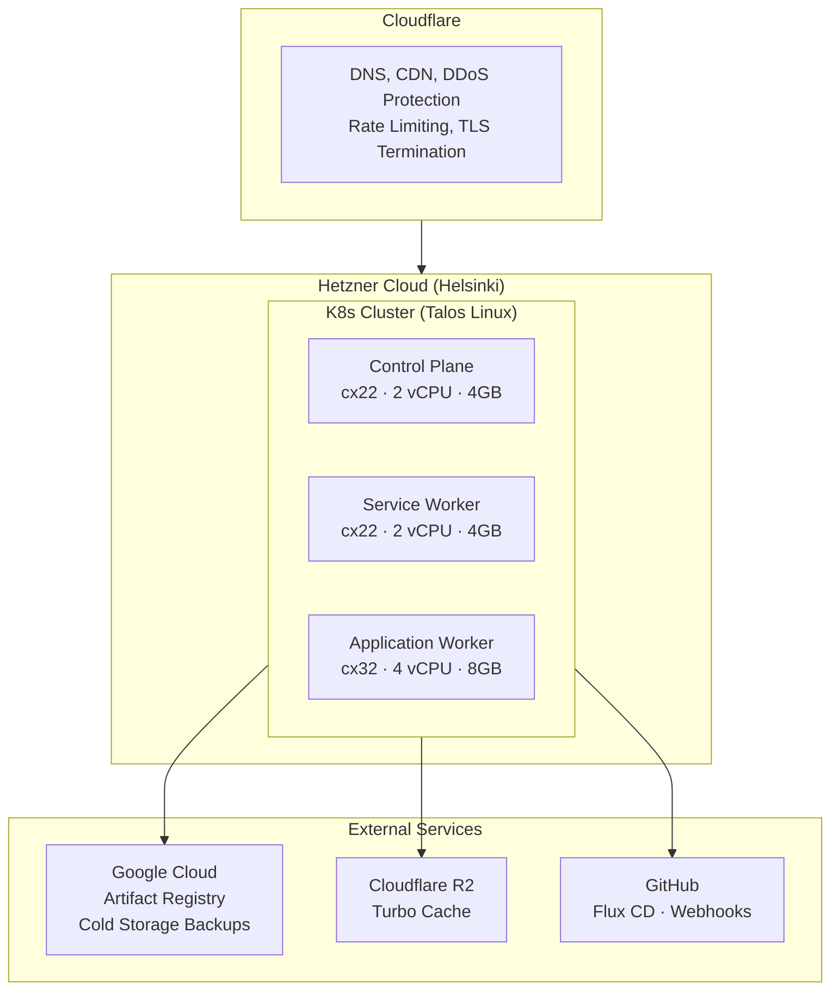

# Gift Fight Infrastructure (Archived)

Archived infrastructure codebase for the Gift Fight project, published as a technical demonstration.

Production infrastructure managed via Pulumi (TypeScript) across multiple cloud providers with a GitOps-first approach using Flux CD.

### Cloud Architecture



### Cloud Providers

| Provider | Purpose |
|----------|---------|
| **Hetzner Cloud** | Kubernetes cluster hosting (Talos Linux, Flannel CNI) |
| **Cloudflare** | DNS, CDN, DDoS protection, rate limiting, TLS certificates, R2 storage |
| **Google Cloud** | Container registry (Artifact Registry), cold storage backups, scheduled cleanup |
| **GitHub** | GitOps source of truth, Flux CD webhooks |
| **Infisical** | Centralized secrets management |

### Infrastructure Stacks

| Stack | Description |
|-------|-------------|
| `HetznerClusterStack` | Kubernetes cluster with Talos Linux on Hetzner |
| `CloudflareStack` | DNS records, zone settings, rate limiting, bot protection |
| `CloudflareTlsStack` | Origin CA certificates and Kubernetes TLS secrets |
| `GcloudStack` | Artifact Registry and cold storage bucket |
| `GcloudCleanupStack` | Automated cleanup of old container images |
| `GcloudSecretsStack` | GCP credentials as Kubernetes secrets |
| `CommonSecretsStack` | Cross-platform secret distribution |
| `FluxBootstrap` | Flux CD GitOps automation |
| `FluxWebhookStack` | GitHub webhook receiver for push-based deployments |
| `TurboCacheStorageStack` | Cloudflare R2 bucket for Turborepo cache |

### Repository Structure

```
.
├── src/
│   ├── index.ts              # Main Pulumi entry point
│   ├── config.ts             # Environment & app configuration
│   ├── stacks/               # Infrastructure stack definitions
│   ├── resources/            # Reusable Pulumi components
│   └── shared/               # Type utilities
└── Pulumi.yaml               # Pulumi project configuration
```

### Key Infrastructure Patterns

- **Immutable Infrastructure**: Talos Linux provides a minimal, immutable OS for Kubernetes nodes
- **GitOps Deployments**: Flux CD watches GitHub repository for declarative deployments
- **Multi-Cloud Strategy**: Compute on Hetzner, edge on Cloudflare, registry on GCP
- **Secrets as Code**: All secrets provisioned via Pulumi during cluster bootstrap
- **Component Resources**: Modular Pulumi `ComponentResource` classes for reusability

### Related Tools

This project uses [pulumi-terraform-mirrors](https://github.com/risenxxx/pulumi-terraform-mirrors) — my tool for automatic mirroring of Terraform providers to Pulumi packages. Useful when official Pulumi providers are outdated or unavailable.
